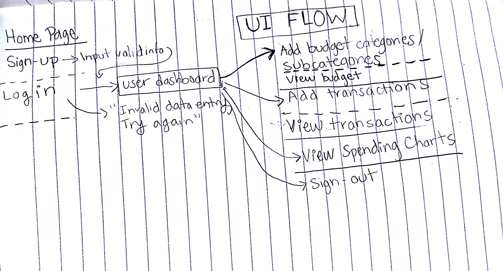
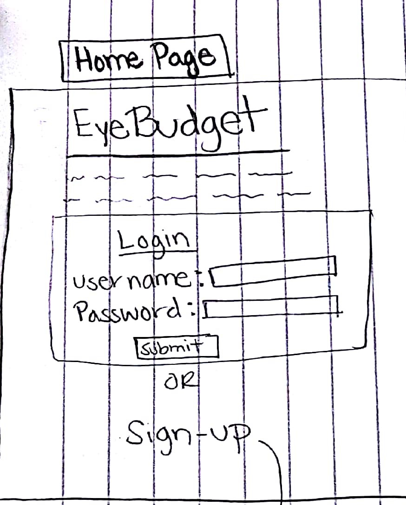
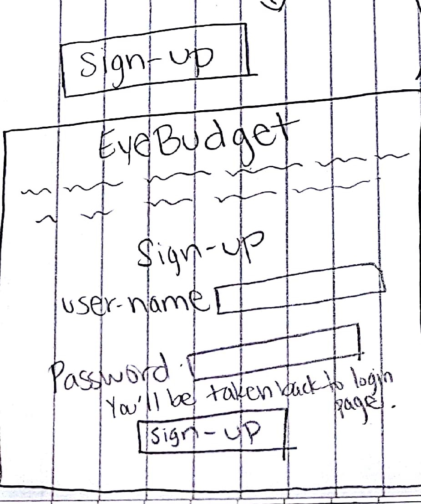
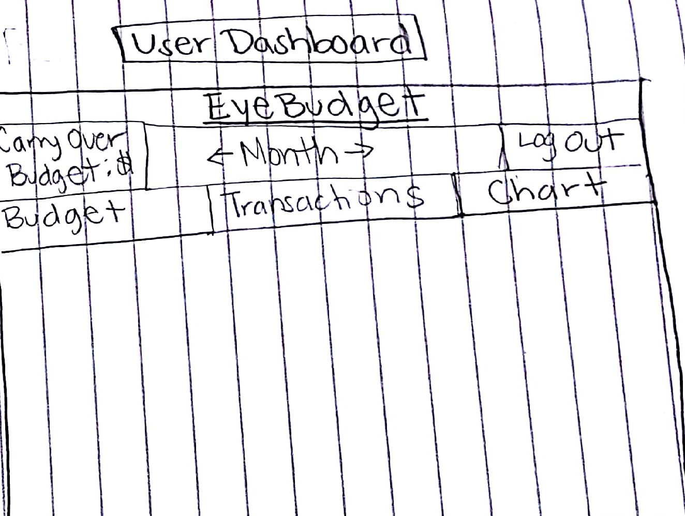
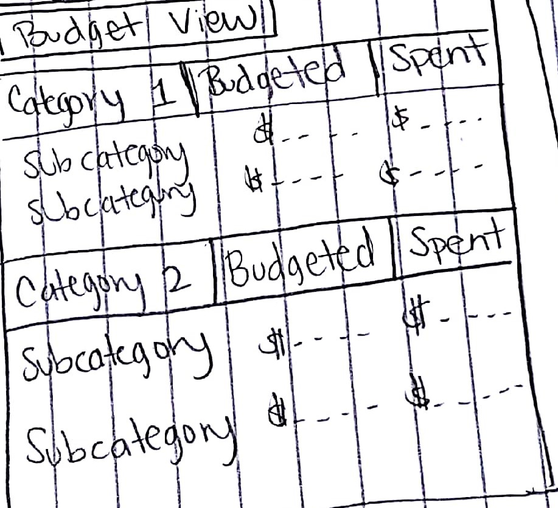
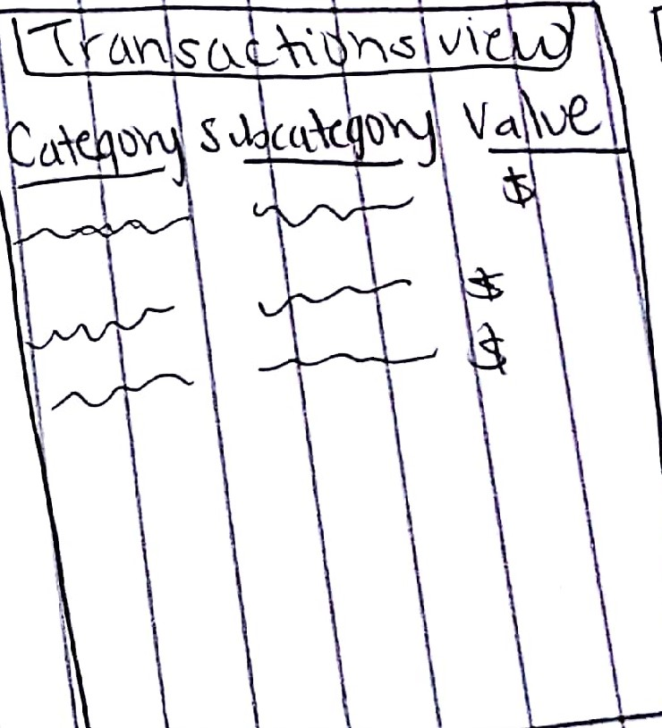
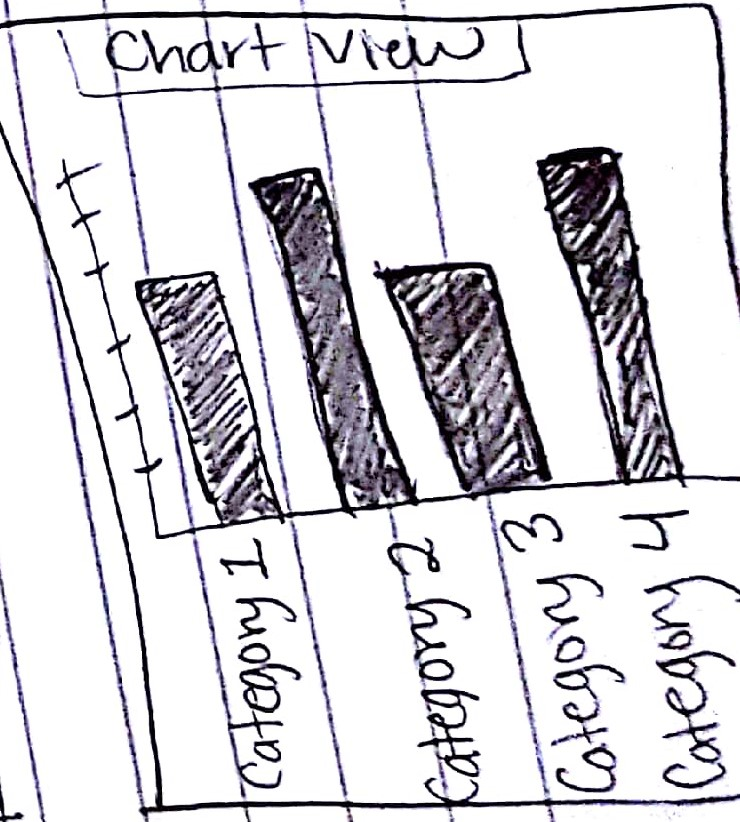

# budgeting-app-node-capstone
Live Pre-view available at https://budgeting-app-node-capstone.herokuapp.com/

# Goal & Use Case

This is a simple budgeting app where someone can create their own spending categories and subcategories for their budget each month and track expenses.

# Screenshots
???

# User Stories & Initial UX
As a {USER TYPE}, I want to {BUSINESS FUNCTIONALITY}, in order to {BUSINESS JUSTIFICATION}.'

**Landing Page**
Step 1. As a visitor, I want to land on the main page and understand what this website is about in order for me to use it.

Step 2. As a visitor, I want to be able to easily sign-up to be able to use the application. In any page, I should be able to sign out.

Step 3. As a user, I want to be able to land on the dasboard, and click around to easily understand how to use the application.

Step 4. As a user, I want to easily create new budget categories and sub-categories and enter the amounts I plan to spend for each. I also want to be able to see the budgeted and actual spent for each.

Step 5. As a user, I want to enter transactions and assign them to my categories and see a history of them. Those transactions, should automatically transfer to the budget page and add to the correct category/subcategory spent totals.

Step 6. As a user, I want to see a chart showing totals for each category so I can get a quick visual of where my money is spent.

# Technical stack

**Front-end**
 * HTML5
 * CSS3
 * JavaScript
 * jQuery

**Back-end**
 * NodeJS
 * Mongoose / MongoDB
 * Heroku (hosting)

**Testing**
 * Mocha & Chai
 * TravisCI

**Responsiveness**
 * The site is fully responsive on most mobile & laptop devices.
 * Tested on Chrome, Firefox & Safari.

**Security**
 * Passport
 * Bcrypt

 ## NODE command lines
* npm install ==> install all node modules
* nodemon server.js ==> run node server
* npm test ==> run the tests

# Development Roadmap
???

### Version 1.1
 *Add login feature so user can save their own collections of cards
 *Add feature that will allow user to click a card and temporarily save it to a side bar in order to better communicate what the user wants or needs
 *Add button at the top of the show all page that will show all edit buttons, otherwise hide all edit buttons
 *Allow users to capture their own images and add to app
  *Give options for user to change the background and card colors
